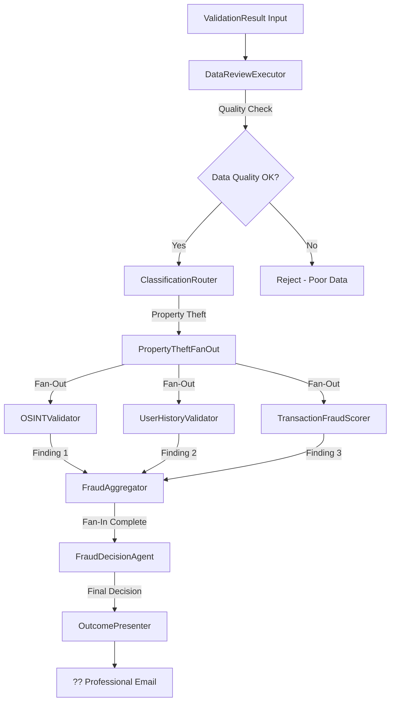

# Demo 12: Claims Fraud Detection Workflow

## Overview

This demo implements a **comprehensive fraud detection pipeline** that takes a validated claim from Demo11 and analyzes it through multiple AI agents working in parallel to detect potential fraud indicators. It demonstrates fan-out/fan-in patterns, shared state aggregation, and multi-perspective fraud analysis.

## ?? CRITICAL PATTERN DISCOVERED (Test01-Test06)

Through systematic testing (Test01 through Test06), we discovered a **critical limitation** in the Microsoft Agent Framework when using fan-out/fan-in patterns with workflow context state operations:

### ?? What BREAKS Fan-In Routing:

**Fan-out executors (source nodes) using `context.ReadStateAsync()` or `context.QueueStateUpdateAsync()`**

```csharp
// ? THIS BREAKS FAN-IN - Aggregator never receives the return value!
private sealed class OSINTExecutor : IMessageHandler<string, OSINTFinding>
{
    public async ValueTask<OSINTFinding> HandleAsync(...)
    {
        var state = await context.ReadStateAsync<...>();  // ? BREAKS IT!
        // ... do work ...
        await context.QueueStateUpdateAsync(..., state);  // ? BREAKS IT!
        return finding;  // ? This return value never reaches the aggregator!
    }
}
```

### ? What WORKS:

#### 1. **Fan-Out Executor (PropertyTheftFanOut):** Read state BEFORE SendMessage
```csharp
public async ValueTask HandleAsync(...)
{
    // ? Read state in fan-out executor (before SendMessage)
    var state = await context.ReadStateAsync<...>();
    var claim = state.OriginalClaim;
    
    // ? Send data via message
    await context.SendMessageAsync(claim, ...);
}
```

#### 2. **Fan-Out Source Executors (OSINT, UserHistory, Transaction):** NO state operations!
```csharp
public async ValueTask<OSINTFinding> HandleAsync(
    ValidationResult claim,  // ? Receive data via parameter
    ...)
{
    // ? NO context.ReadStateAsync()
    // ? NO context.QueueStateUpdateAsync()
    // ? Work with passed data only
    
    var finding = ...; // Do work
    return finding;  // ? Returns successfully to aggregator!
}
```

#### 3. **Aggregator:** State operations work perfectly!
```csharp
public async ValueTask<string> HandleAsync(...)
{
    // ? Aggregator CAN use state operations freely!
    var state = await context.ReadStateAsync<...>();
    state.OSINTFinding = finding;
    await context.QueueStateUpdateAsync(..., state);
    
    return result;
}
```

#### 4. **Other Executors (outside fan-in):** State operations work fine
```csharp
// DataReview, Classification, FraudDecision, OutcomePresenter
// ? All can use context state operations normally
```

### ?? Test Results Summary:

| Test | Pattern | Result |
|------|---------|--------|
| Test01 | Function-based, no async | ? WORKS |
| Test02 | Class-based, no async | ? WORKS |
| Test03 | Class-based, mock async (Task.Delay) | ? WORKS |
| Test04 | **Fan-out: context state (blocking)** | ? **FAILS** |
| Test05 | **Fan-out: context state (async/await)** | ? **FAILS** |
| Test06 | **Aggregator: context state** | ? **WORKS!** |

**Conclusion:** The issue is NOT blocking vs async - it's using `context.ReadStateAsync()`/`context.QueueStateUpdateAsync()` **in fan-out source executors specifically**.

### ?? The Working Pattern:

```
PropertyTheftFanOut (reads state, sends claim data)
    ?
    SendMessage(claim)
    ?
    ?? OSINTExecutor(claim) ? OSINTFinding (NO STATE OPS!)
    ?? UserHistoryExecutor(claim) ? UserHistoryFinding (NO STATE OPS!)
    ?? TransactionExecutor(claim) ? TransactionFraudFinding (NO STATE OPS!)
    ?
FraudAggregator (collects findings, stores in state)
```

### ?? GitHub Issue Filed:
[Link to issue when filed]

---

## Workflow Architecture



## The Six-Phase Pipeline

### Phase 1: Data Quality Review
**Executor:** `DataReviewExecutor`  
**Agent:** `DataReviewAgent`

**Purpose:** Ensure data quality before expensive fraud analysis

**Checks:**
- ? Completeness - all required fields present
- ? Consistency - values make logical sense
- ? Data quality - descriptions detailed enough
- ? Obvious red flags - glaring suspicious patterns

**Output:** `DataReviewResult` with quality score (0-100) and proceed/reject decision

---

### Phase 2: Classification Routing
**Executor:** `ClassificationRouterExecutor`

**Purpose:** Route claim to appropriate fraud detection handler based on type

**Current Routes:**
- ?? **Property Theft** ? PropertyTheftFanOutExecutor

**Future Routes (Extensible):**
- ?? Auto Collision
- ?? Medical Claims
- ?? Property Damage
- ?? Business Interruption

---

### Phase 3: Parallel Fraud Detection (Fan-Out)

Three specialized agents work **concurrently** to analyze different fraud signals:

#### 3A. OSINT Validator Agent ??
**Executor:** `OSINTExecutor`  
**Tool:** `check_online_marketplaces`

**Mission:** Find if stolen property is listed for sale online

**Searches:**
- ???? ricardo.ch (Swiss marketplace)
- ???? anibis.ch (Swiss classifieds)
- ?? eBay Switzerland
- ?? Facebook Marketplace

**Output:** `OSINTFinding` with:
- Item found (yes/no)
- Matching listings with details
- Fraud indicator score (0-100)
- Summary of findings

**Mock Logic:** Items valued >$1,000 are "found" online (suspicious!)

---

#### 3B. User History Validator Agent ??
**Executor:** `UserHistoryExecutor`  
**Tool:** `get_customer_claim_history`

**Mission:** Analyze customer's claim history for suspicious patterns

**Analyzes:**
- Total claims filed
- Claims in last 12 months
- Pattern of claim types (e.g., 3 bike thefts in a row?)
- Previous fraud flags
- Historical fraud score

**Output:** `UserHistoryFinding` with:
- Previous claims count
- Suspicious activity detected (yes/no)
- Customer fraud score (0-100)
- Claim history summary
- Analysis summary

**Mock Data:**
- **CUST-10001**: 5 claims, 3 bike thefts, fraud score 65 ??
- **CUST-10002**: 2 claims, clean history, fraud score 20 ?

---

#### 3C. Transaction Fraud Scorer Agent ??
**Executor:** `TransactionFraudExecutor`  
**Tool:** `get_transaction_risk_profile`

**Mission:** Score this specific transaction for fraud indicators

**Red Flags:**
- ?? High value claims (>$1,000)
- ? Claim filed immediately after loss
- ?? Geographic anomalies
- ?? Description quality issues
- ?? Timing patterns (e.g., just before policy expires)

**Output:** `TransactionFraudFinding` with:
- Anomaly score (0-100)
- List of red flags detected
- Transaction fraud score (0-100)
- Summary

**Mock Logic:** 
- High value + immediate filing = fraud score 75
- Only high value = fraud score 25
- Clean = fraud score 0

---

### Phase 4: Fraud Aggregation (Fan-In)
**Executor:** `FraudAggregatorExecutor`

**Purpose:** Collect all three findings into shared state

**Pattern:** Implements the **collector pattern**
- Waits for 3 findings (OSINT, User History, Transaction)
- Stores each in shared `FraudAnalysisState`
- Only proceeds when all 3 are received

**Shared State:**
```csharp
FraudAnalysisState {
    OriginalClaim: ValidationResult
    OSINTFinding: OSINTFinding
    UserHistoryFinding: UserHistoryFinding  
    TransactionFraudFinding: TransactionFraudFinding
    FraudDecision: FraudDecision (after Phase 5)
}
```

---

### Phase 5: Final Fraud Decision
**Executor:** `FraudDecisionExecutor`  
**Agent:** `FraudDecisionAgent`

**Purpose:** AI analyzes ALL findings and makes final determination

**Decision Factors:**
- OSINT fraud score
- Customer fraud score
- Transaction fraud score
- Pattern analysis across all three
- Contextual reasoning

**Output:** `FraudDecision` with:
- `is_fraud`: true/false final determination
- `confidence_score`: 0-100 confidence level
- `combined_fraud_score`: 0-100 overall risk
- `recommendation`: APPROVE / INVESTIGATE / REJECT
- `reasoning`: Clear explanation
- `key_factors`: List of decisive factors

**Example Decision Matrix:**
| OSINT | User | Trans | Decision | Recommendation |
|-------|------|-------|----------|----------------|
| 85 | 65 | 75 | FRAUD | REJECT |
| 15 | 20 | 25 | NO FRAUD | APPROVE |
| 50 | 45 | 60 | UNCLEAR | INVESTIGATE |

---

### Phase 6: Professional Email Generation
**Executor:** `OutcomePresenterExecutor`  
**Agent:** `OutcomePresenterAgent`

**Purpose:** Generate professional email for insurance case handler

**Email Includes:**
- ?? Executive summary
- ?? Fraud determination & confidence
- ?? Key findings from each agent
- ? Recommended action
- ?? Next steps
- ?? Supporting data

**Tone:** Professional, factual, formal - suitable for legal review

---

## Mock Data & Tools

### Mock Tools

#### 1. `CheckOnlineMarketplaces`
**Simulates:** Searching Swiss and international marketplaces

**Logic:**
```csharp
value > $1000 ? Item found (85% fraud indicator)
value ? $1000 ? Item not found (15% fraud indicator)
```

**Example Output:**
```json
{
  "marketplaces_checked": ["ricardo.ch", "anibis.ch", "ebay.ch", "facebook_marketplace"],
  "item_found": true,
  "matching_listings": [
    "Ricardo.ch listing: Red mountain bike, Trek brand, CHF 950 - Listed 3 days after reported theft"
  ],
  "fraud_indicator": 85
}
```

---

#### 2. `GetCustomerClaimHistory`
**Simulates:** Retrieving customer's past claims from database

**Mock Customers:**

**CUST-10001 (High Risk):**
```json
{
  "total_claims": 5,
  "claims_last_12_months": 3,
  "previous_fraud_flags": 1,
  "customer_fraud_score": 65,
  "claim_history": [
    "2024-12: BikeTheft - APPROVED - $800",
    "2024-09: WaterDamage - APPROVED - $1,500",
    "2024-06: BikeTheft - FLAGGED (duplicate pattern) - $900",
    "2023-12: Burglary - APPROVED - $2,000",
    "2023-08: BikeTheft - APPROVED - $600"
  ]
}
```

**CUST-10002 (Low Risk):**
```json
{
  "total_claims": 2,
  "claims_last_12_months": 1,
  "previous_fraud_flags": 0,
  "customer_fraud_score": 20,
  "claim_history": [
    "2024-10: Collision - APPROVED - $3,000",
    "2022-03: Theft - APPROVED - $500"
  ]
}
```

---

#### 3. `GetTransactionRiskProfile`
**Simulates:** Analyzing transaction-level risk factors

**Logic:**
```csharp
Red Flags:
- High value (>$1000) ? +1 flag
- Recent claim (<7 days) ? +1 flag
- Both ? +1 additional flag

Risk Score = flag_count × 25
```

**Example Output:**
```json
{
  "amount_percentile": 85,
  "timing_anomaly": true,
  "red_flags": [
    "High value claim (>$1000)",
    "Claim filed immediately after incident",
    "High value + immediate filing pattern"
  ],
  "transaction_risk_score": 75
}
```

---

## Key Concepts Demonstrated

### ? Fan-Out / Fan-In Pattern
```
       [Router]
          ?
    ?????????????
    ?     ?     ?
  [A]   [B]   [C]  ? Parallel execution
    ?     ?     ?
    ?????????????
          ?
    [Aggregator]  ? Fan-in collection
```

### ? Shared State Pattern
- All executors read/write to `FraudAnalysisState`
- State persisted via workflow-scoped storage
- Enables aggregation across parallel branches

### ? Structured Outputs
- All agents use `ChatResponseFormat.ForJsonSchema<T>()`
- Type-safe JSON responses
- No manual parsing required

### ? Mock Tool Integration
- Three specialized mock tools
- Simulate real-world fraud detection services
- Hardcoded data for reproducible demos

### ? Multi-Agent Orchestration
- 6 specialized agents with clear responsibilities
- Sequential phases with parallel sub-processes
- Clean separation of concerns

### ? Conditional Routing
- Data quality gate before fraud analysis
- Classification by claim type (extensible)
- Aggregator waits for all findings

---

## Running the Demo

### Console Execution

1. Ensure Azure OpenAI credentials in `AIConfig.cs`
2. In `Program.cs`:
   ```csharp
   await Demo12_ClaimsFraudDetection.Execute();
   ```
3. Run the project
4. Watch the fraud analysis pipeline execute

### Expected Output

```
=== Demo 12: Claims Fraud Detection Workflow ===

Analyzing claim:
  Customer: CUST-10001
  Type: Property - BikeTheft
  Amount: $1,200.00

=== Data Quality Review ===
Quality Score: 85/100
Proceed: True

=== Classification Router ===
Claim Type: Property
Sub-Type: BikeTheft

=== Parallel Fraud Detection (Fan-Out) ===
Dispatching to 3 fraud detection agents...

=== OSINT Validation (Online Marketplaces) ===
?? Tool called: check_online_marketplaces('...', $1200)
? OSINT Check Complete - Fraud Score: 85/100

=== User History Analysis ===
?? Tool called: get_customer_claim_history('CUST-10001')
? User History Check Complete - Customer Fraud Score: 65/100

=== Transaction Fraud Scoring ===
?? Tool called: get_transaction_risk_profile($1200, '2025-01-21')
? Transaction Analysis Complete - Fraud Score: 75/100

[FraudAggregator] Received finding from OSINT (1/3)
[FraudAggregator] Received finding from UserHistory (2/3)
[FraudAggregator] Received finding from Transaction (3/3)

=== All Fraud Findings Collected (Fan-In) ===

=== Final Fraud Decision ===
????????????????????????????????????????????????????????????????????????????????
FRAUD DETERMINATION: LIKELY FRAUD
Confidence: 85%
Recommendation: INVESTIGATE
????????????????????????????????????????????????????????????????????????????????

=== Generating Case Handler Email ===

Subject: Fraud Alert - Claim CLM-20250128-XXXX Requires Investigation

Dear Claims Handler,

This is an automated fraud analysis report for claim CLM-20250128-XXXX...

[Professional email follows]

? FRAUD ANALYSIS COMPLETE
```

---

## Example Scenarios

### Scenario 1: High-Risk Fraud (CUST-10001)
**Input:**
- Customer: CUST-10001 (5 prior claims, 3 bike thefts)
- Amount: $1,200
- Type: BikeTheft

**Findings:**
- OSINT: Item found on ricardo.ch (85)
- User History: 3 bike thefts, fraud score 65
- Transaction: High value + immediate (75)

**Decision:**
- Is Fraud: TRUE
- Confidence: 85%
- Recommendation: **INVESTIGATE**

---

### Scenario 2: Low-Risk Clean Claim (CUST-10002)
**Input:**
- Customer: CUST-10002 (2 prior claims, clean)
- Amount: $500
- Type: BikeTheft

**Findings:**
- OSINT: Not found online (15)
- User History: Clean, fraud score 20
- Transaction: Low value, clean (0)

**Decision:**
- Is Fraud: FALSE
- Confidence: 92%
- Recommendation: **APPROVE**

---

## Architecture Patterns

### Fan-Out Pattern
```csharp
.AddFanOutEdge(propertyTheftFanOutExec, 
    targets: [osintExec, userHistoryExec, transactionExec])
```

Benefits:
- ? Parallel execution (faster)
- ?? Independent perspectives
- ?? No sequential dependencies

### Fan-In Pattern
```csharp
.AddFanInEdge(fraudAggregatorExec, 
    sources: [osintExec, userHistoryExec, transactionExec])
```

Benefits:
- ?? Consolidate all findings
- ?? Holistic analysis
- ? Synchronized continuation

### Shared State Pattern
```csharp
private static async Task<FraudAnalysisState> ReadFraudStateAsync(IWorkflowContext context)
{
    var state = await context.ReadStateAsync<FraudAnalysisState>(
        FraudStateShared.Key, 
        scopeName: FraudStateShared.Scope);
    return state ?? new FraudAnalysisState();
}
```

Benefits:
- ?? Persistent across executors
- ?? No data loss during workflow
- ?? Clean aggregation pattern

---

## Extending the Demo

### Add New Claim Types

1. **Create New Router Path:**
```csharp
// In ClassificationRouterExecutor
if (claim.NormalizedClaimType == "Auto")
    return "AutoCollision";
```

2. **Create Specialized Agents:**
```csharp
var mechanic InspectorAgent = GetMechanicInspectorAgent(chatClient);
var accidentSceneAnalyzer = GetAccidentSceneAgent(chatClient);
```

3. **Add New Fan-Out:**
```csharp
.AddEdge(classificationExec, autoCollisionFanOutExec)
.AddFanOutEdge(autoCollisionFanOutExec, 
    targets: [mechanicExec, sceneAnalyzerExec])
```

### Add Real Services

Replace mock tools with real APIs:
- **OSINT**: Integrate with marketplace APIs
- **User History**: Connect to claims database
- **Transaction Risk**: Call fraud scoring service

```csharp
AIFunctionFactory.Create(RealFraudTools.CheckRicardoAPI)
```

### Add ML Models

Integrate machine learning fraud models:
```csharp
var mlFraudScore = await FraudML.PredictFraudProbability(claim);
```

---

## Comparison with Demo11

| Aspect | Demo11 (Intake) | Demo12 (Fraud Detection) |
|--------|-----------------|--------------------------|
| **Purpose** | Gather claim data | Detect fraud |
| **Pattern** | Sequential with loops | Parallel with fan-out/fan-in |
| **Agents** | Intake, Validation, Processing | Data Review, OSINT, User History, Transaction, Decision, Presenter |
| **User Input** | Interactive (UserInputExecutor) | Batch (pre-validated claim) |
| **Tools** | Customer/Contract lookup | Marketplace search, history retrieval, risk scoring |
| **State** | Claim data + customer | Fraud findings aggregation |
| **Output** | Claim confirmation | Fraud report email |

---

## Production Considerations

### Security
- ?? Encrypt sensitive fraud data
- ?? Role-based access to fraud tools
- ?? Audit trail for all fraud determinations

### Performance
- ? Parallel execution reduces latency
- ?? Cache customer history for repeat checks
- ?? Use async throughout

### Accuracy
- ?? Tune fraud score thresholds
- ?? A/B test decision logic
- ?? Validate against historical fraud cases

### Compliance
- ?? GDPR compliance for customer data
- ?? Fair lending / anti-discrimination
- ?? Explainable AI for legal review

---

## Related Demos & Samples

- **Demo11**: Claims Intake Workflow (provides input for Demo12)
- **Sample14**: Software Development Pipeline (fan-out/fan-in pattern)
- **Sample21**: Feature Compliance Review (complex routing)
- **Sample17/19**: Writer-Critic patterns (iterative refinement)

---

## Key Takeaways

? **Fan-Out/Fan-In** - Parallel execution for independent analysis  
? **Shared State** - Aggregate findings from multiple sources  
? **Structured Outputs** - Type-safe JSON from all agents  
? **Mock Tools** - Simulate real services with hardcoded data  
? **Multi-Agent Orchestration** - 6 agents, each with specific role  
? **Classification Routing** - Extensible by claim type  
? **Professional Output** - Email generation for case handlers  
? **Fraud Detection Signals** - OSINT + History + Transaction analysis

---

**Author:** Jose Luis Latorre  
**License:** LicenseRef-MAFPlayground-NPU-1.0-CH  
**Framework:** Microsoft Agent Framework  
**Date:** January 2025
