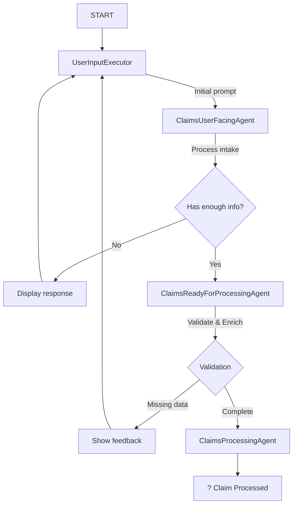

# Demo 11: Claims Processing Workflow

## Overview

This demo implements a **three-agent claims workflow** that simulates a realistic insurance claims intake and processing system. It demonstrates conversational AI, structured workflows, data validation, and feedback loops.

## Workflow Architecture



## The Four Components

### 1. UserInputExecutor (NEW! ??)
**Role:** Interactive input handler within the workflow

**Responsibilities:**
- Prompt user for input at each conversation turn
- Display agent responses to user
- Handle quit commands
- Loop back to itself when more information needed
- Pure workflow component (no external chat loop required)

**Benefits:**
- ? Workflow is fully self-contained
- ? DevUI can visualize and interact with the entire flow
- ? Clean separation between orchestration and I/O
- ? No mixing of concerns in the host code

### 2. ClaimsUserFacingAgent (Intake)
**Role:** Conversational intake specialist

**Goals:**
- Gather customer identification (ID or name)
- Collect claim details in a natural, empathetic manner
- Don't overwhelm the customer with too many questions at once
- Confirm when enough information is collected

**Required Information:**
```csharp
// Customer Identification (one of):
- customer_id (if known)
- OR: first_name + last_name (for lookup)

// Claim Details:
- claim_type (Property, Auto, Health)
- claim_sub_type (BikeTheft, WaterDamage, etc.)
- date_of_loss
- date_reported
- short_description (1-2 sentences)
- detailed_description (including purchase price)
```

**Output:** `IntakeDecision` with structured JSON indicating readiness to proceed or questions to ask.

### 3. ClaimsReadyForProcessingAgent (Validation & Enrichment)
**Role:** Validation and data enrichment specialist

**Responsibilities:**
1. **Resolve Customer ID** - If only name provided, call `get_customer_profile` tool
2. **Fetch Contract** - Use `get_contract` tool to find policy
3. **Normalize Data** - Standardize claim_type and claim_sub_type
4. **Validate Completeness** - Check all mandatory fields
5. **Generate Feedback** - If incomplete, create natural language questions for intake agent

**Output:** `ValidationResult` with:
- `ready`: true/false
- `missing_fields`: what's missing
- `blocking_issues`: critical problems
- `suggested_questions`: questions to ask user
- Resolved `customer_id` and `contract_id`
- Normalized claim types

### 4. ClaimsProcessingAgent (Final Processing)
**Role:** Claims processor

**Responsibilities:**
1. Generate unique claim ID (format: `CLM-YYYYMMDD-XXXX`)
2. Provide friendly confirmation to customer
3. Summarize claim details
4. Explain next steps
5. Set status to `ReadyForBackOffice`

**Output:** Confirmation message with claim summary.

## Key Features

### ? Conversational Intake
- Natural language interaction
- Empathetic questioning
- One or two questions at a time
- Context-aware follow-ups

### ? Structured Feedback Loops
```
User Input ? Intake ? Validation
     ?          ?          ?
     ???????????????????????
   (Feedback via UserInputExecutor)
```

### ? Customer & Contract Resolution
Uses mock tools:
- `get_current_date()` ? Current date and time (for "today" references)
- `get_customer_profile(firstName, lastName)` ? Customer ID + email
- `get_contract(customerId)` ? Contract details + coverage

### ? Iteration Safety
- Max 15 intake iterations to prevent infinite loops
- Auto-advance on reaching limit

### ? State Management
Shared state across workflow:
```csharp
ClaimWorkflowState:
- IntakeIteration
- Status (Draft/PendingValidation/Ready/NeedsMoreInfo)
- Customer (resolved info)
- ClaimDraft (all claim details)
- ConversationHistory
- ContractId
```

## Mock Data

### Customers
| Name | ID | Email | Contract Type |
|------|-----|-------|---------------|
| John Smith | CUST-10001 | john.smith@example.com | Property |
| Jane Doe | CUST-10002 | jane.doe@example.com | Auto |
| Alice Johnson | CUST-10003 | alice.johnson@example.com | Property |

### Contracts
- **CONTRACT-P-5001**: Property (BikeTheft, WaterDamage, Fire)
- **CONTRACT-A-5002**: Auto (Collision, Theft)
- **CONTRACT-P-5003**: Property (BikeTheft, Burglary)

## Example Conversation

```
[Workflow starts]

UserInputExecutor: ?? Welcome to Claims Intake!
Please describe your situation, and I'll help you file a claim.

You: "Hello, I need to file a claim."

ClaimsIntakeAgent: "I'm sorry to hear that. I'm here to help you file a claim.
To get started, could you please provide your name?"

?? Agent: I'm sorry to hear that. I'm here to help you file a claim.
To get started, could you please provide your name?

You: "John Smith"

ClaimsIntakeAgent: "Thank you, John. What type of claim would you like to file?"

?? Agent: Thank you, John. What type of claim would you like to file?

You: "My bike was stolen."

ClaimsIntakeAgent: "I understand, that must be frustrating. When did this happen?"

?? Agent: I understand, that must be frustrating. When did this happen?

You: "Last Tuesday around 2 PM."

ClaimsIntakeAgent: "Got it. Can you describe what happened and provide details about the bike?"

?? Agent: Got it. Can you describe what happened and provide details about the bike?

You: "I locked my mountain bike outside the grocery store. When I came out 20 minutes later, it was gone. The bike was worth about $1,200."

ClaimsIntakeAgent: "Thank you for those details, John. Let me validate this information..."

? Information complete. Proceeding to validation...

[ClaimsValidationExecutor runs]
?? Tool called: get_customer_profile('John', 'Smith')
?? Tool called: get_contract('CUST-10001')

[ClaimsProcessingExecutor runs]

? CLAIM PROCESSED SUCCESSFULLY

Claim ID: CLM-20250128-4532
Customer: John Smith (CUST-10001)
Contract: CONTRACT-P-5001 (Property)
Claim Type: Property - BikeTheft
Date of Loss: 2025-01-21

Next Steps:
1. A claims adjuster will review your case within 2 business days
2. You may be contacted for additional information or photos
3. You can track your claim status at claims.example.com

Thank you for your patience, John.
```

## Technical Implementation

### Workflow Pattern
Uses **Self-Contained Workflow** pattern with UserInputExecutor:
- **UserInput** prompts and displays (I/O boundary)
- **Intake** gathers data from user responses
- **Validation** checks completeness
- **Processing** finalizes claim

**No external chat loop needed!** The workflow orchestrates everything internally.

### Flow Diagram
```
string "START" ? UserInput ? Intake ? IntakeDecision
                    ?           ?
                    ????????????? (if not ready: loop)
                                ?
                          (if ready) ? Validation ? ValidationResult
                                            ?
                                      (if not ready) ? UserInput (feedback)
                                            ?
                                      (if ready) ? Processing ? ChatMessage
```

### Structured Output
All agents use `ChatResponseFormat.ForJsonSchema<T>()` for type-safe responses:
- No manual JSON parsing
- Guaranteed schema compliance
- Clear contracts between agents

### Tool Integration
Agents use `AIFunctionFactory.Create()` to register C# methods as tools:
```csharp
var tools = new List<AITool>
{
    AIFunctionFactory.Create(ClaimsMockTools.GetCurrentDate),
    AIFunctionFactory.Create(ClaimsMockTools.GetCustomerProfile),
    AIFunctionFactory.Create(ClaimsMockTools.GetContract)
};
```

### State Persistence
Uses workflow-scoped state:
```csharp
await context.QueueStateUpdateAsync(
    ClaimStateShared.Key, 
    state, 
    scopeName: ClaimStateShared.Scope
);
```

## Running the Demo

### Console Mode (Interactive)
1. Set up Azure OpenAI credentials in `AIConfig.cs`
2. In `Program.cs`, use:
   ```csharp
   await Demo11_ClaimsWorkflow.Execute();
   ```
3. Run the project
4. Start conversation with: "Hello, I need to file a claim."
5. Type 'quit' to exit

### DevUI Mode (Visual Debugging) ??
1. In `Program.cs`, use:
   ```csharp
   Demo11_ClaimsWorkflow.ExecuteWithDevUI();  // Note: synchronous
   ```
2. Run the project
3. Open browser to: `http://localhost:5000/devui`
4. Select "claims-workflow" from dropdown
5. Start conversation in the UI
6. Watch the workflow execute step-by-step!

**DevUI Benefits:**
- ? Visual workflow execution
- ? Step-by-step executor tracking
- ? Real-time state inspection
- ? Agent conversation history
- ? Tool call monitoring
- ? See loops and feedback in action

## Key Concepts Demonstrated

? **Conversational AI** - Natural language intake with context awareness

? **Multi-Agent Orchestration** - Three agents with clear responsibilities

? **Structured Workflows** - Conditional routing based on validation results

? **Feedback Loops** - Agents can loop back with structured feedback

? **Tool Integration** - Mock services for customer and contract lookup + date helper

? **State Management** - Shared state across workflow execution

? **Structured Output** - Type-safe JSON responses with schema enforcement

? **Iteration Safety** - Max iteration caps to prevent infinite loops

? **Self-Contained Workflow** - UserInputExecutor makes workflow fully autonomous

? **DevUI Compatible** - Pure workflow orchestration (no external loops)

## Architecture Decision: UserInputExecutor

### Why UserInputExecutor?

This demo uses a **UserInputExecutor** instead of an external chat loop for several key reasons:

#### 1. ? **Pure Workflow Orchestration**
```csharp
// With UserInputExecutor (Self-Contained)
var workflow = new WorkflowBuilder(userInputExec)
    .AddEdge(userInputExec, intakeExec)
    .AddSwitch(intakeExec, ...)
    .Build();

await InProcessExecution.StreamAsync(workflow, "START");
// Workflow handles EVERYTHING internally

// vs. External Loop (Mixed Concerns)
while (!complete)
{
    var input = Console.ReadLine(); // Host handles I/O
    await agent.RunAsync(input);     // Workflow handles logic
}
```

#### 2. ? **DevUI Compatibility** ??
The DevUI can:
- Visualize the complete flow including user interaction
- Step through each executor (including UserInput)
- Inject test inputs at the UserInputExecutor
- See the full state at each step

With an external chat loop, the DevUI can't "see" the conversation management.

#### 3. ? **Testability**
```csharp
// Easy to mock UserInputExecutor for automated tests
var mockInputs = new Queue<string>(["John Smith", "My bike was stolen", ...]);
var testInputExec = new MockUserInputExecutor(mockInputs);
// Run workflow with test data
```

#### 4. ? **Consistency with Framework Patterns**
- The workflow is a pure data flow
- All orchestration logic is explicit in the workflow definition
- No hidden state in the host code

## Comparison with Sample17

| Aspect | Sample17 (Writer-Critic) | Demo11 (Claims) |
|--------|--------------------------|-----------------|
| **Domain** | Content writing | Insurance claims |
| **Agents** | Writer, Critic, Summary | Intake, Validation, Processing |
| **Input** | Single prompt | Conversational dialog |
| **Iterations** | Content refinement | Data gathering |
| **Tools** | None | Customer/Contract lookup |
| **State** | Content + history | Customer + claim details |
| **User Input** | Single initial prompt | UserInputExecutor (in workflow) |
| **Architecture** | Linear iteration | Self-contained with I/O executor |

## Future Enhancements

Potential improvements for production:
1. **Real Database Integration** - Replace mock tools with actual services
2. **Document Upload** - Allow photos of damage
3. **Multi-Turn Deep Dive** - More sophisticated conversation trees
4. **Fraud Detection** - Add fraud analysis agent
5. **Coverage Verification** - Check if claim type is covered
6. **Estimate Generation** - Automated cost estimation
7. **Claim Status Tracking** - Real-time status updates
8. **Multi-Language Support** - Internationalization

## Related Samples

- **Sample17**: Writer-Critic workflow (pattern foundation)
- **Sample19**: Structured output with JSON schema
- **Demo09**: MCP tool integration
- **Sample16**: Chat-based workflow interaction

---

**Author:** Jose Luis Latorre  
**License:** LicenseRef-MAFPlayground-NPU-1.0-CH  
**Framework:** Microsoft Agent Framework  
**Date:** January 2025
